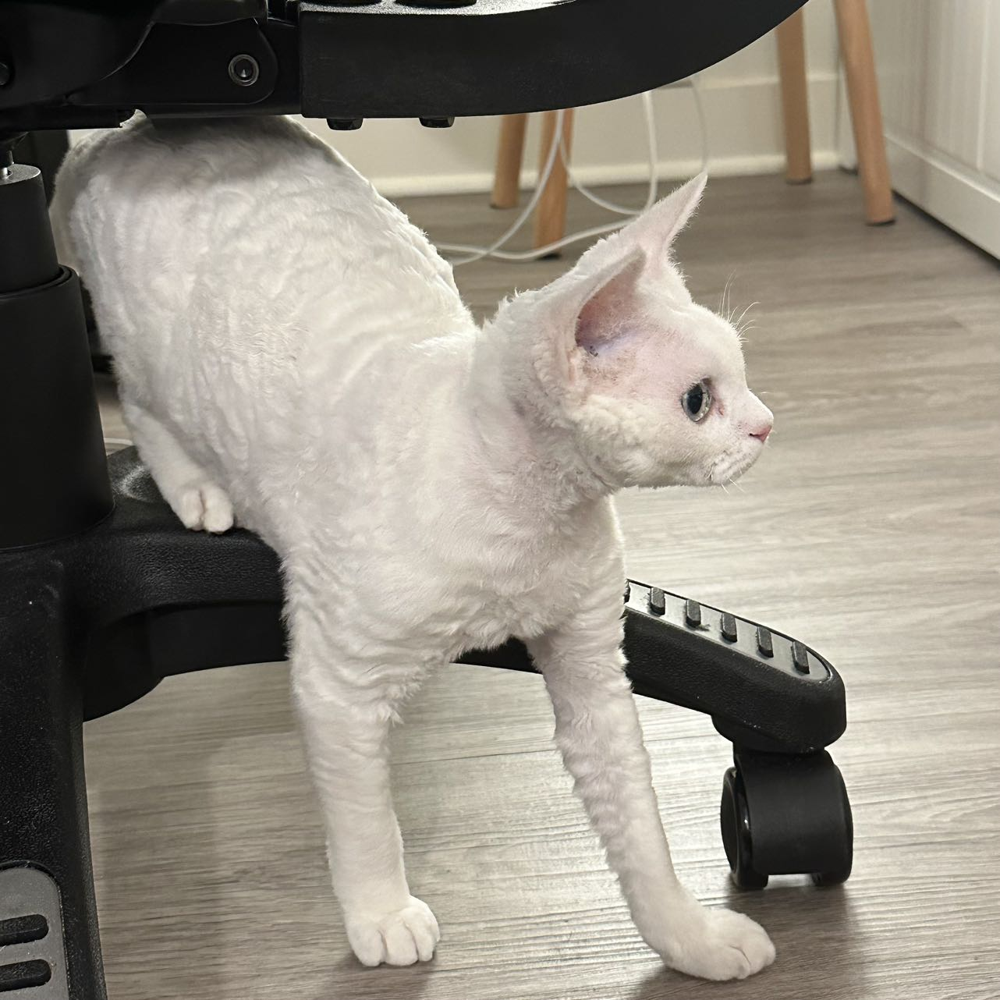

# Willa Wei

"Hello Class!"

This is Willa Wei. I am a second year MPP student. I was born and raised in China. I graduated from Mizzou J-School, so I have strategic communication and journalism background before Harris. I'm a visual person, so I want to learn more about data visualization and see what I can do in the future. 

My policy interest are public health and finance. During my free time I would just listening to R&B music and spend time with my cat.

Here is my cat picture, her name is YeYe. Sometime she is kind annoying but I love her.

Nice to meet you! :)
