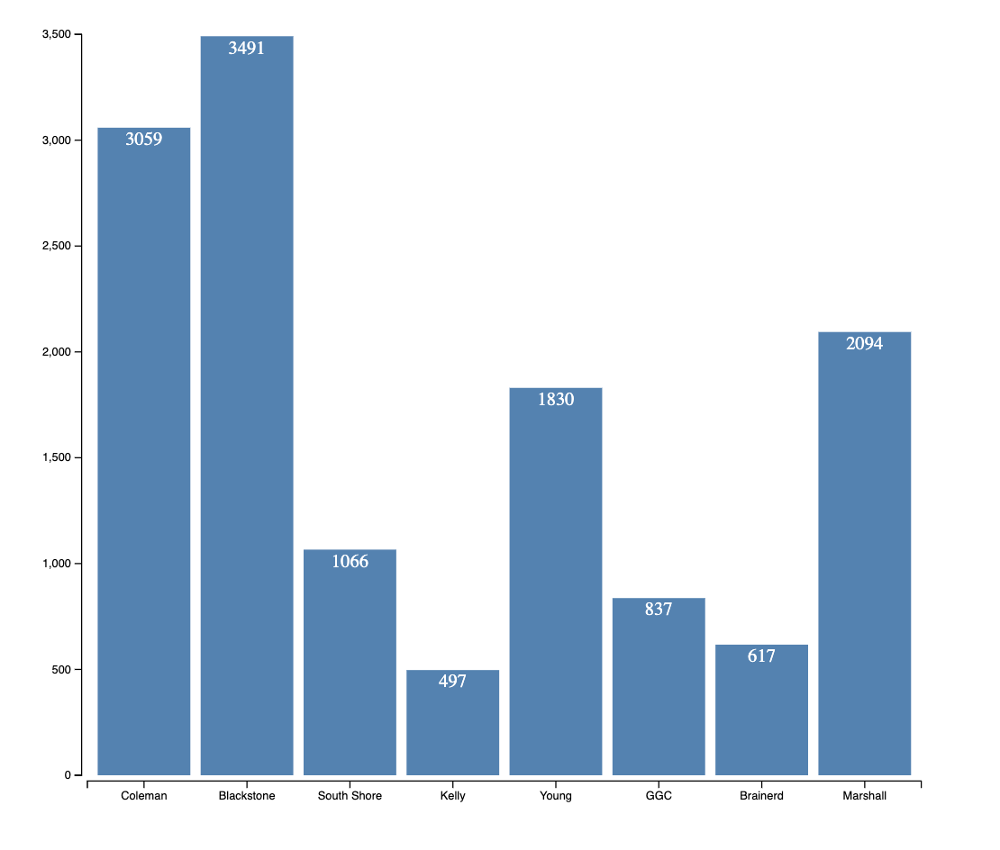

### Visualizing Library Visits Information 

## Description

In this homework, I used D3 library to try to construct a basic data visualisation bar chart to show the number of visit the library branches in University of Chicago. This data comes from Chicago Data Portal.

## Dictionary

<table align="center">
	<tbody>
		<tr>
			<td>File Name</td>
			<td>Content</td>
		</tr>
		<tr>
			<td>homework.html</td>
			<td>This is the html file that shows the final page</td>
		</tr>
		<tr>
			<td>homework.js</td>
			<td>This is the javascript file that we are learning how to use d3 library and make it combined as data visualization</td>
		</tr>
		<tr>
			<td>library_visits_jan22.csv</td>
			<td>Data set download from Chicago Data Portal</td>
		</tr>
		<tr>
			<td>lib_visit_jan22.png</td>
			<td>Data Visualization</td>
		</tr>
	</tbody>
</table>

## Findings:

According to the Chicago Data Portal, Blackstone Library Branch is the most popular with 3491 visiting in Janurary, 2022. Meanwhile Kelly seems like was the least popular one with only 497 visiting.