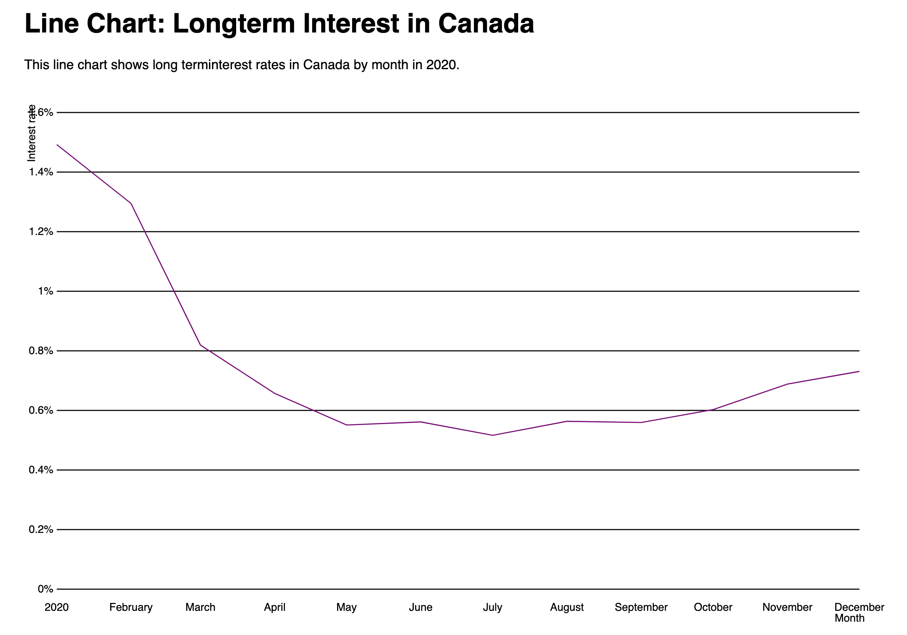

### Line Chart Exercise

## Description

In this homework, I used D3 library to try to construct a basic data visualisation line chart. The data used for this line chart is "long-term-interest-canada.csv".

## Dictionary

<table align="center">
	<tbody>
		<tr>
			<td>File Name</td>
			<td>Content</td>
		</tr>
		<tr>
			<td>homework.html</td>
			<td>This is the html file that shows the final page</td>
		</tr>
		<tr>
			<td>homework.js</td>
			<td>This is the javascript file that we are learning how to use d3 library and make it combined as data visualization</td>
		</tr>
	</tbody>
</table>
